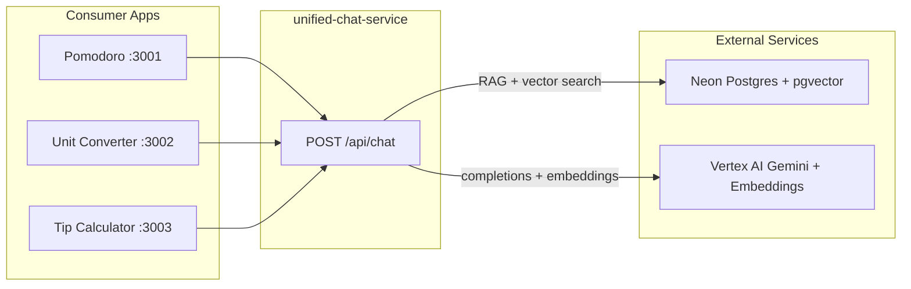
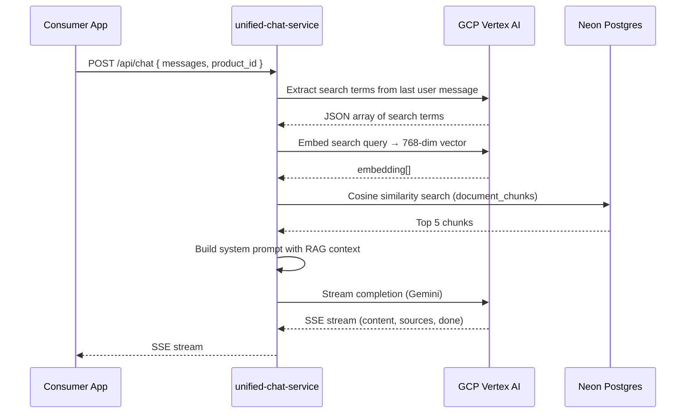
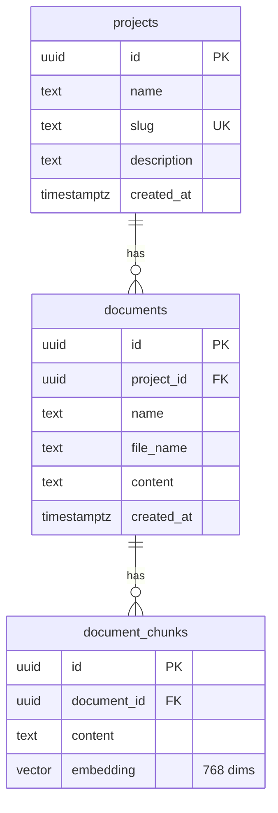

# Unified Chat Service — Architecture

This document describes the overall architecture of the Unified Chat system, including external services, API contracts, and consumer apps.

## High-Level Architecture



- **Consumers** call `/api/chat` (chat + RAG). The service registers events automatically; consumers do not POST to `/api/events`.
- **Library** (`/library`) uses GitHub OAuth; you manage projects and documents there.
- **init-db** creates tables (projects, documents, document_chunks) in Neon.

## Services Used

| Service | Purpose |
|---------|---------|
| **Neon Postgres** | Vector store (pgvector) for RAG, projects, documents, document_chunks |
| **GCP Vertex AI** | Gemini 2.5 Flash for chat completions; text-embedding-005 for embeddings |
| **NextAuth (GitHub)** | OAuth for `/library` document management |
| **Vercel** | Hosting for service and consumer apps |

## RAG Flow (Chat Request)



## API Contracts

### POST /api/chat

**Request:**

```json
{
  "product_id": "uuid-from-library",
  "user": { "id": "user-123", "name": "User Name" },
  "messages": [
    { "role": "user", "content": "How do I convert metres to feet?" },
    { "role": "assistant", "content": "To convert metres to feet..." }
  ]
}
```

**Response:** Server-Sent Events (SSE), `Content-Type: text/event-stream`

| Event type | Payload | Description |
|------------|---------|-------------|
| `search` | `{ searchTerms: string[] }` | Search terms extracted for RAG |
| `status` | `{ message: string }` | Status message (e.g. "Looking up guidance…") |
| `content` | `{ content: string }` | Streaming response chunk |
| `sources` | `{ sources: { title: string; url: string }[] }` | RAG source documents |
| `done` | `{}` | Stream complete |

**CORS:** Only origins listed in `ALLOWED_ORIGINS` are allowed.

---

### POST /api/events (optional, for custom integrations)

**Request:**

```json
{
  "productId": "uuid",
  "productName": "Unit Converter",
  "type": "message_sent",
  "payload": { "content": "How do I convert..." }
}
```

**Response:** `201` with `{ ok: true }`

Chat events (message_sent, search, message_received, error) are **registered automatically** by the chat route when handling POST /api/chat. Consumer apps do not need to call this endpoint. POST /api/events remains available for custom integrations.

---

### GET /api/events

**Query:** `?productId=uuid` (optional)

**Response:** Array of event objects (up to 100, most recent first).

---

## Data Model (Neon / pgvector)



- **projects:** One per consumer product (Pomodoro, Unit Converter, Tip Calculator).
- **documents:** Reference docs uploaded via `/library`.
- **document_chunks:** Text chunks with embeddings for similarity search.
